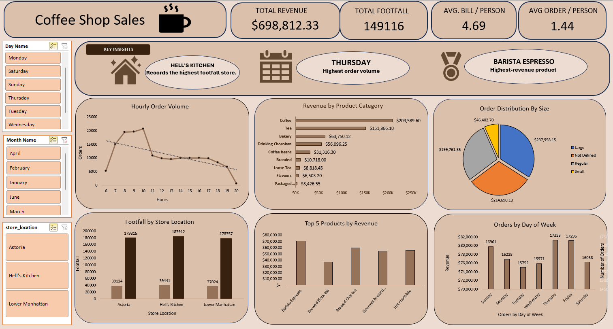

# Coffee Sales Analytics — Power Query ETL & Excel Dashboard

## Project Overview

This project focuses on analyzing coffee sales data using Microsoft Excel and Power Query. The project follows an ETL (Extract, Transform, Load) workflow to transform raw sales data into an analysis-ready dataset and an interactive Excel dashboard.

## Dataset

The dataset contains 149,116 coffee shop transaction records across 11 columns. Each row represents a single coffee shop transaction, containing information about when the transaction occurred, the store where it took place, the product purchased, and the quantity and price of the transaction.

### Dataset Structure

| Column Name | Description |
|---|---|
| `transaction_id` | Unique identifier for each transaction |
| `transaction_date` | Date on which the transaction occurred |
| `transaction_time` | Time at which the transaction occurred |
| `transaction_qty` | Quantity of products purchased in the transaction |
| `store_id` | Identifier of the store where the transaction occurred |
| `store_location` | Location of the store |
| `product_id` | Identifier of the product purchased |
| `unit_price` | Price of one unit of the product |
| `product_category` | Category of the product |
| `product_type` | Type of coffee product sold |
| `product_detail` | Detailed description of the product |

### Data Source

The dataset was obtained from [maven analytics](https://maven-datasets.s3.amazonaws.com/Coffee+Shop+Sales/Coffee+Shop+Sales.zip).

## Data Preparation & Power Query ETL

Power Query was used to clean and transform the raw coffee sales dataset before analysis. The transformation process was designed to improve data consistency and prepare the dataset for use in PivotTables, calculations, and dashboard visualizations.

### Transformation Workflow

The following transformations were applied to the dataset:

#### 1. Changed Data Types

The data types of the columns were explicitly defined to ensure that each field could be used appropriately during analysis.

- `transaction_id` → Whole Number
- `transaction_date` → Date
- `transaction_time` → Time
- `transaction_qty` → Whole Number
- `store_id` → Whole Number
- `store_location` → Text
- `product_id` → Whole Number
- `unit_price` → Decimal Number
- `product_category` → Text
- `product_type` → Text
- `product_detail` → Text

#### 2. Removed Duplicates

Exact duplicate records were removed using Power Query's `Table.Distinct` transformation. The duplicate check was performed across the complete row rather than against a single column.

#### 3. Filtered Rows

A row-filtering step was included in the query. The final filter condition was `each true`, meaning that all rows were retained at this stage and no additional records were excluded.

#### 4. Trimmed Store Location Text

The `store_location` field was cleaned using Power Query's `Text.Trim` function. A new column named `Trim` was created containing the trimmed values from `store_location`.

This was used to remove unnecessary leading and trailing spaces and improve consistency in the location field.

#### 5. Reordered Columns

The columns were reorganized to place the newly created `Trim` column alongside the other store-related information.

#### 6. Removed Original Store Location

The original `store_location` column was removed after the trimmed version had been created.

#### 7. Renamed Cleaned Column

The cleaned `Trim` column was renamed to `store_location`, resulting in a cleaned and standardized location field while maintaining the original column name used by the dataset.

## Dashboard Preview

The cleaned and transformed dataset was used to build an interactive Excel dashboard to analyze coffee shop sales performance across product categories, store locations, and time periods.

### Key Insights

* ☕ **Coffee** generates the highest category revenue.
* 🏪 **Hell's Kitchen** records the highest store footfall.
* 📅 **Thursday** records the highest sales.
* 📈 The dashboard provides an overview of revenue, transactions, product performance, and store-level activity.

## Tools Used

* **Microsoft Excel** — Data analysis, PivotTables, calculations, and dashboard development
* **Power Query** — Data cleaning and transformation
* **Excel Charts & Visualizations** — Interactive dashboard reporting

## Project Workflow

The project followed the following workflow:

**Raw Data → Power Query ETL → Cleaned Dataset → Analysis → Dashboard → Business Insights**

## Final Deliverable

The final deliverable is an interactive Excel dashboard that transforms the raw coffee shop transaction data into a visual summary of sales performance and key business insights.
